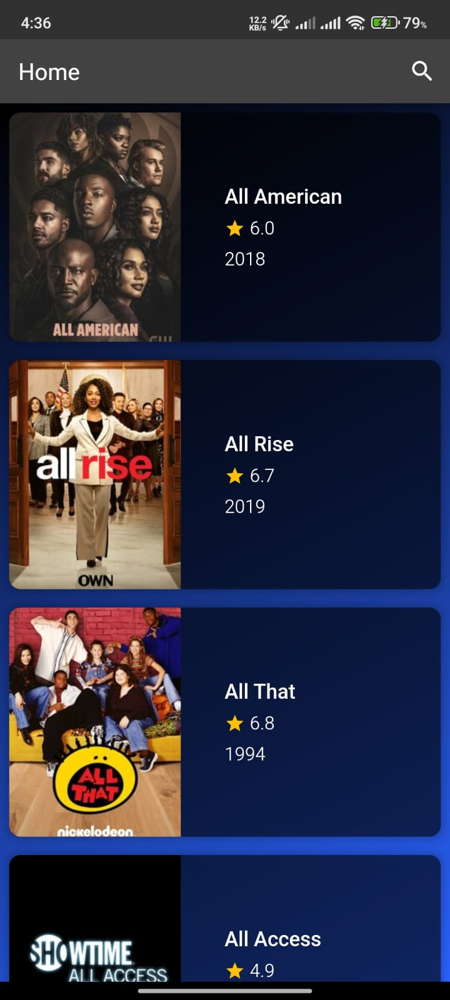

# NIKFLIX-using-Flutter

An all-in-one app for everything related to movies and shows. Built with Flutter, this app allows users to search, explore, and get detailed information about their favorite movies and TV shows.

## Features

- Search for movies and TV shows
- View detailed information about each movie/show (genre, cast, IMDb rating, etc.)
- Movie/TV Show posters and images
- Responsive UI designed for mobile devices

## Screenshots

Here are some screenshots of the app in action:




> *Note: Images should be added to the `/images` folder of your project directory. You can upload them to your GitHub repository.*

## Installation

Follow these steps to run the project on your local machine:

1. Clone this repository:
   ```bash
   git clone https://github.com/Nikson2003/NIKFLIX-using-Flutter.git

2. Navigate to the project directory:
   ```bash
   cd NIKFLIX-using-Flutter

3. Install the dependencies:
   ```bash
   flutter pub get

4. Run the app:
   ```bash
   flutter run

## Usage

1. Launch the app, and you'll be able to search for movies and TV shows.
2. Browse through the results, view detailed information, and explore genres, cast, and ratings.
